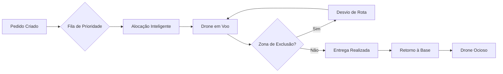
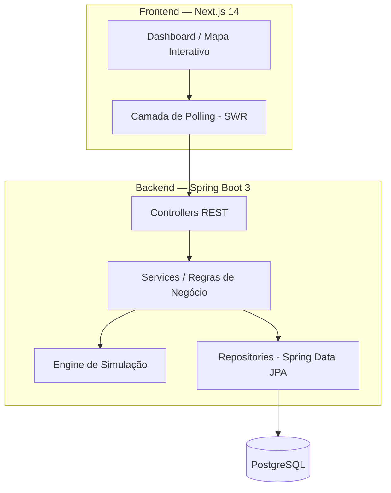
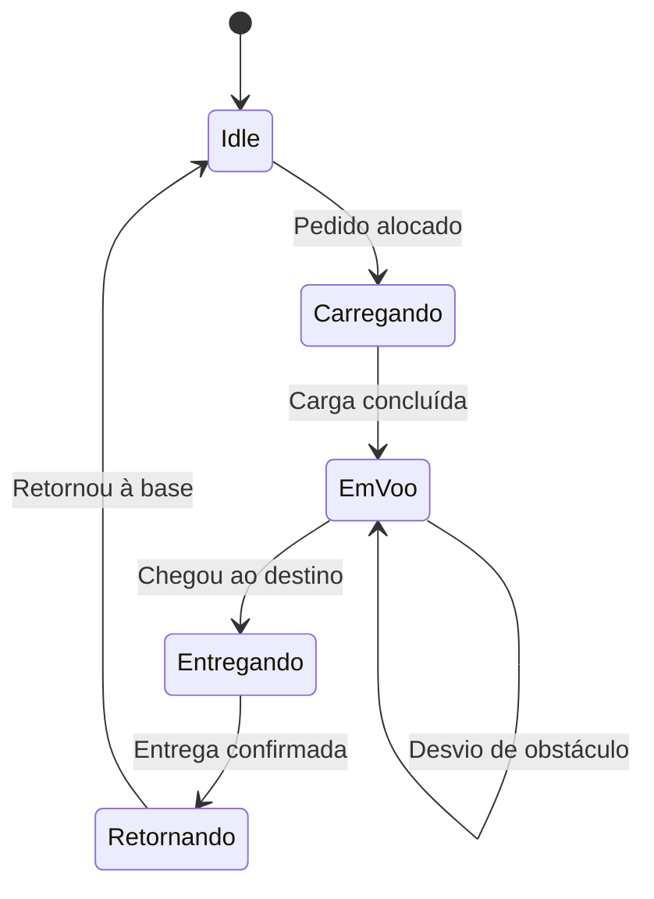

# AeroGrid
 
### Simulador de Entregas Autônomas por Drones
 
Plataforma full-stack para orquestração, roteamento e monitoramento de frotas de drones em tempo real.
 
[](https://openjdk.org/)
[](https://spring.io/projects/spring-boot)
[](https://nextjs.org/)
[](https://www.typescriptlang.org/)
[](https://www.postgresql.org/)
[](https://www.docker.com/)
[](#licença)
 
[Visão Geral](#visão-geral) ·
[Funcionalidades](#funcionalidades) ·
[Arquitetura](#arquitetura-e-diagramas) ·
[Instalação](#execução-local-com-docker-compose) ·
[Deploy](#deploy-no-render) ·
[API](#endpoints-da-api)
 
</div>
---
 
## Visão Geral
 
**AeroGrid** é um simulador full-stack de logística aérea autônoma. O sistema recria, em um plano cartesiano, o ciclo completo de operação de uma frota de drones — da criação do pedido até a entrega final — combinando algoritmos de alocação inteligente, desvio dinâmico de obstáculos e visualização em tempo real.
 
Pensado como ferramenta educacional e demonstrativa, o projeto aplica na prática conceitos como máquinas de estado finito, estratégias de roteamento, processamento orientado a eventos e engenharia de dados em tempo real.
 
### Ciclo de Vida da Simulação
 
| Etapa | Descrição |
|---|---|
| 1. Criação de Pedidos | Peso, coordenadas de destino e prioridade (Baixa, Média, Alta) |
| 2. Alocação Inteligente | Pedidos são atribuídos a drones ociosos respeitando capacidade e prioridade |
| 3. Simulação Física | Drones se movem a cada *tick*, consomem bateria e desviam de obstáculos |
| 4. Gestão de Frota | CRUD completo de drones com validação de status operacional |
| 5. Painel de Controle | KPIs em tempo real, mapa interativo e fila de pedidos ao vivo |
 

 
---
 
## Funcionalidades
 
**Frota e Pedidos**
- Cadastro, edição e remoção de drones com validação de status
- Criação de pedidos com prioridade e destino personalizado
- Alocação automática via estratégia de mochila com prioridade
- Fila de pedidos ordenada dinamicamente
**Simulação e Visualização**
- Movimentação realista no plano cartesiano
- Desvio automático de zonas de exclusão (obstáculos)
- Mapa interativo com zoom e rastreamento de rotas via Canvas API
- Painel com mais de 12 métricas em tempo real (bateria, tempo médio, drones em voo, etc.)
**Dados e Infraestrutura**
- Persistência com PostgreSQL
- Containerização completa com Docker
- Deploy simplificado no Render
**Experiência do Usuário**
- Atualização em tempo real via polling (SWR)
- Notificações toast para eventos da simulação
- Interface responsiva com Tailwind CSS e shadcn/ui
---
 
## Tecnologias Utilizadas
 
**Backend:** Java 21, Spring Boot 3, Spring Data JPA, Hibernate, Maven, Lombok
 
**Frontend:** Next.js 14, TypeScript, Tailwind CSS, shadcn/ui, SWR, Canvas API
 
**Infraestrutura:** Docker, Docker Compose, PostgreSQL, Render
 
---
 
## Arquitetura e Diagramas
 
O sistema segue o padrão MVC no backend, com uma engine de simulação executada em background através de tarefas agendadas (`@Scheduled`). O frontend consome a API REST por meio de *polling* (aproximadamente a cada 2 segundos) para manter os dados sincronizados em tempo real.
 
### Visão Geral da Arquitetura
 

 
> Espaço reservado para o diagrama de classes e pacotes. Insira aqui a imagem gerada a partir do código-fonte.
 

 
### Padrões de Projeto Utilizados
 
| Padrão | Aplicação no AeroGrid |
|---|---|
| State Pattern | Gerenciamento dos estados do drone: Idle, Carregando, EmVoo, Entregando, Retornando |
| Strategy Pattern | Alocação de pedidos (`MochilaPrioridadeAlocacaoStrategy`) e roteamento (`RetaFugindoObstaculoStrategy`) |
| Repository Pattern | Abstração do acesso a dados via Spring Data JPA |
| DTO Pattern | Transferência de dados desacoplada entre camadas |
 
### Máquina de Estados do Drone
 

 
---
 
## Pré-requisitos
 
| Requisito | Obrigatório | Observação |
|---|---|---|
| Git | Sim | Para clonar o repositório |
| Docker e Docker Compose | Sim | Para execução local completa |
| Java 21 e Maven | Não | Apenas para desenvolvimento backend sem Docker |
| Node.js 20 e npm | Não | Apenas para desenvolvimento frontend sem Docker |
 
---
 
## Execução Local com Docker Compose
 
**1. Clone o repositório**
 
```bash
git clone https://github.com/JosueGoulart01/Simulador-de-Encomendas-em-Drone.git
cd Simulador-de-Encomendas-em-Drone
```
 
**2. Acesse a pasta `codigo`, onde está o `docker-compose.yml`**
 
```bash
cd codigo
```
 
**3. Execute o Docker Compose**
 
```bash
docker-compose up -d --build
```
 
**4. Acesse a aplicação**
 
| Serviço | URL |
|---|---|
| Frontend | http://localhost:3000 |
| Backend API | http://localhost:8080/api |
 
**5. Para parar os serviços e limpar os volumes**
 
```bash
docker-compose down -v
```
 
---
 
## Endpoints da API
 
### Drones
 
| Método | Endpoint | Descrição |
|---|---|---|
| GET | `/api/drones` | Lista todos os drones |
| POST | `/api/drones` | Cria um novo drone |
| PUT | `/api/drones/{id}` | Atualiza um drone (somente status `IDLE`) |
| DELETE | `/api/drones/{id}` | Remove um drone (somente status `IDLE`) |
 
### Pedidos
 
| Método | Endpoint | Descrição |
|---|---|---|
| GET | `/api/pedidos` | Lista todos os pedidos |
| POST | `/api/pedidos` | Cria um novo pedido (entra na fila) |
| GET | `/api/pedidos/fila` | Lista pedidos na fila, ordenados por prioridade |
 
### Simulação
 
| Método | Endpoint | Descrição |
|---|---|---|
| GET | `/api/simulacao/dashboard` | Obtém métricas do dashboard em tempo real |
 
### Zonas de Exclusão
 
| Método | Endpoint | Descrição |
|---|---|---|
| GET | `/api/zonas-exclusao` | Lista todas as zonas de exclusão |
| POST | `/api/zonas-exclusao` | Cria uma nova zona |
| DELETE | `/api/zonas-exclusao/{id}` | Remove uma zona |
 
---
 
## Estrutura do Projeto
 
```
codigo/
├── backend/
│   └── Simulador-de-Encomendas-em-Drone/
│       ├── src/
│       │   └── main/
│       │       ├── java/com/example/.../
│       │       │   ├── controller/     # Controladores REST
│       │       │   ├── service/        # Lógica de negócio
│       │       │   ├── repository/     # Interfaces JPA
│       │       │   ├── domain/         # Entidades, estados, estratégias
│       │       │   ├── dto/            # Data Transfer Objects
│       │       │   ├── engine/         # Simulação agendada
│       │       │   └── mapper/         # Conversores DTO <-> Entity
│       │       └── resources/
│       │           └── application.properties
│       ├── Dockerfile
│       ├── pom.xml
│       └── ...
└── frontend/
    ├── app/               # Páginas e layouts Next.js
    ├── components/        # Componentes React (shadcn/ui)
    ├── hooks/             # Hooks customizados (SWR)
    ├── lib/               # Configurações (api, types, utils)
    ├── Dockerfile
    ├── package.json
    ├── next.config.mjs
    └── ...
```
 
---
 
## Roadmap
 
- [ ] Autenticação e controle de acesso multiusuário
- [ ] Histórico de entregas com relatórios exportáveis
- [ ] Suporte a múltiplas bases de origem
- [ ] Simulação de condições climáticas afetando o consumo de bateria
- [ ] Testes automatizados end-to-end (E2E)
- [ ] Modo escuro no dashboard

 
---
 
<div align="center">
**Autor:** Josué Goulart
[GitHub](https://github.com/JosueGoulart01) · [LinkedIn](#)
 
AeroGrid — Simulando o futuro das entregas, um drone de cada vez.
